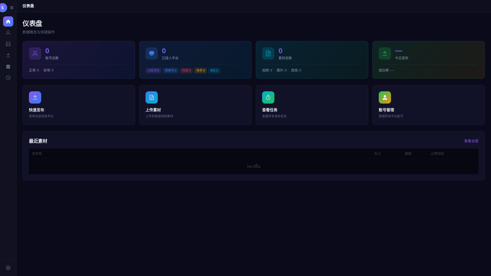
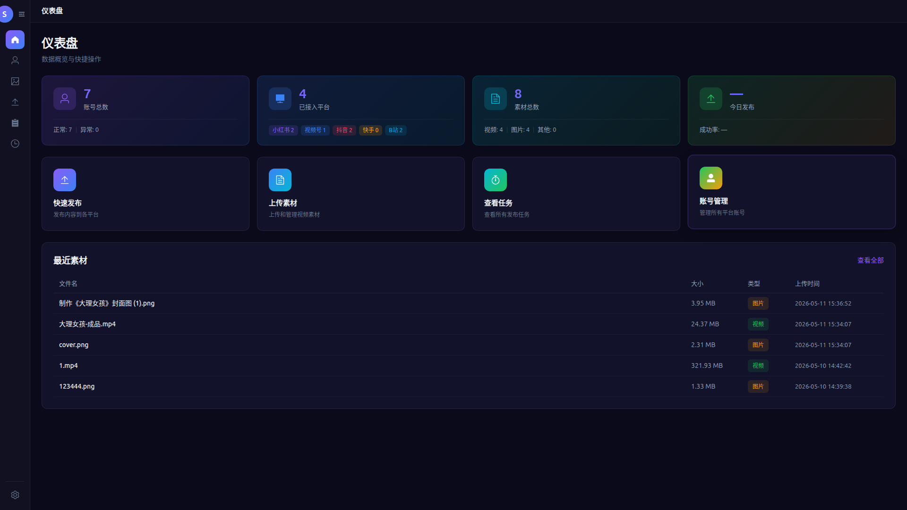
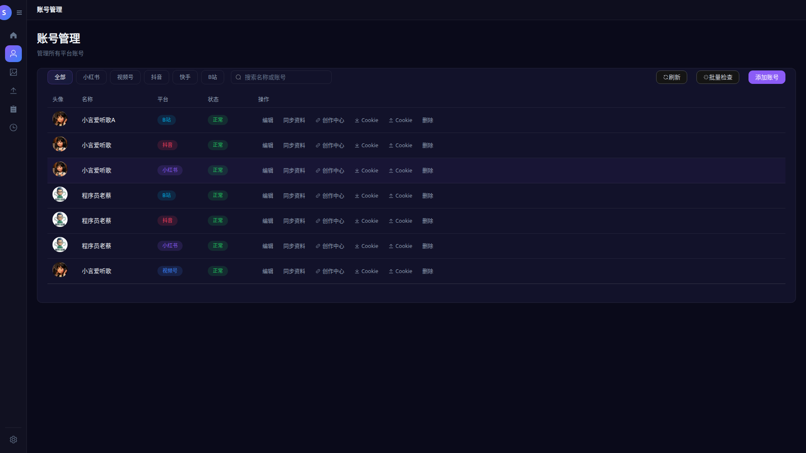
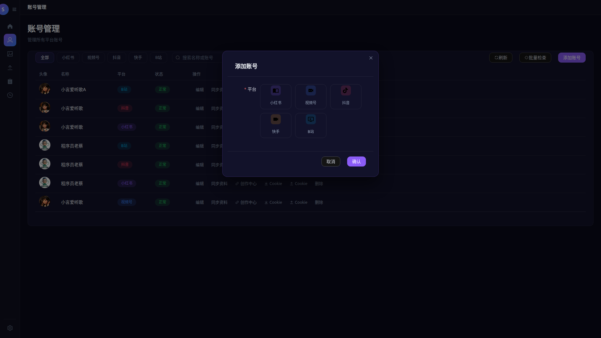
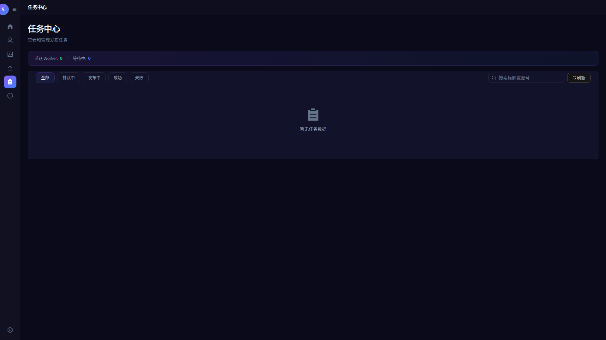
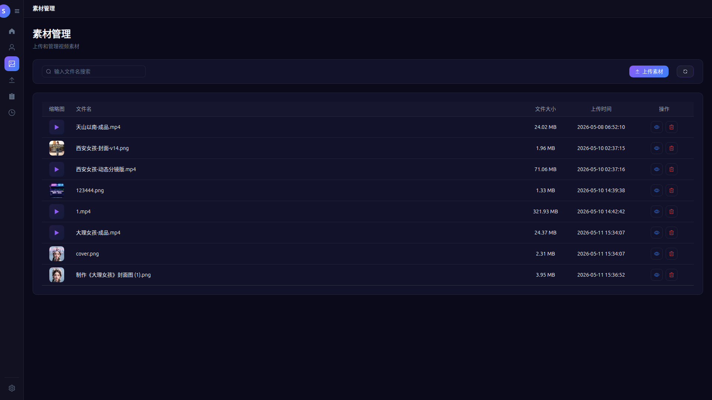
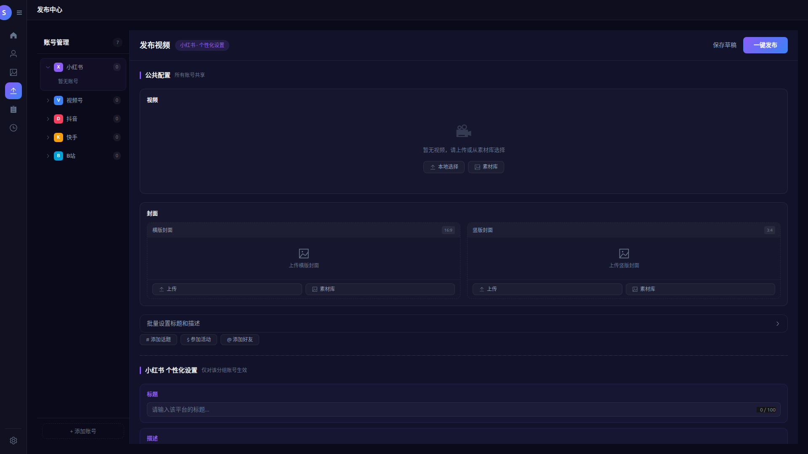
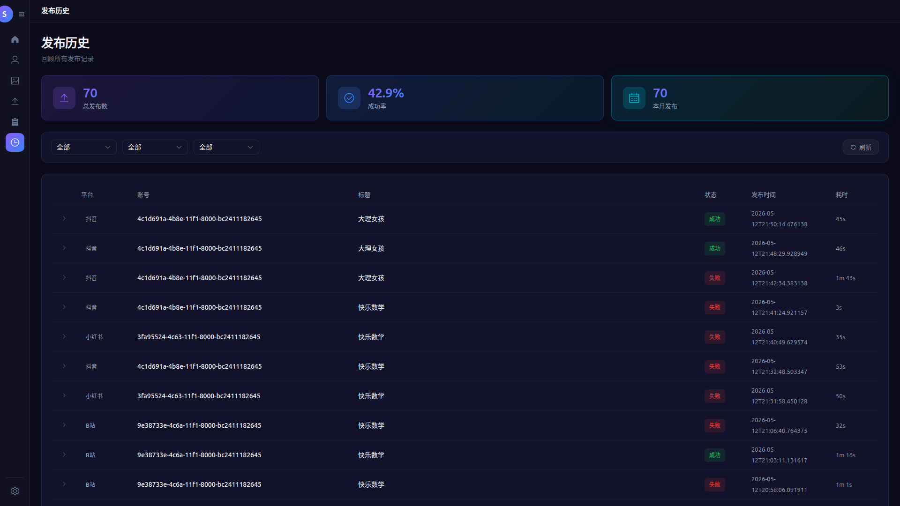
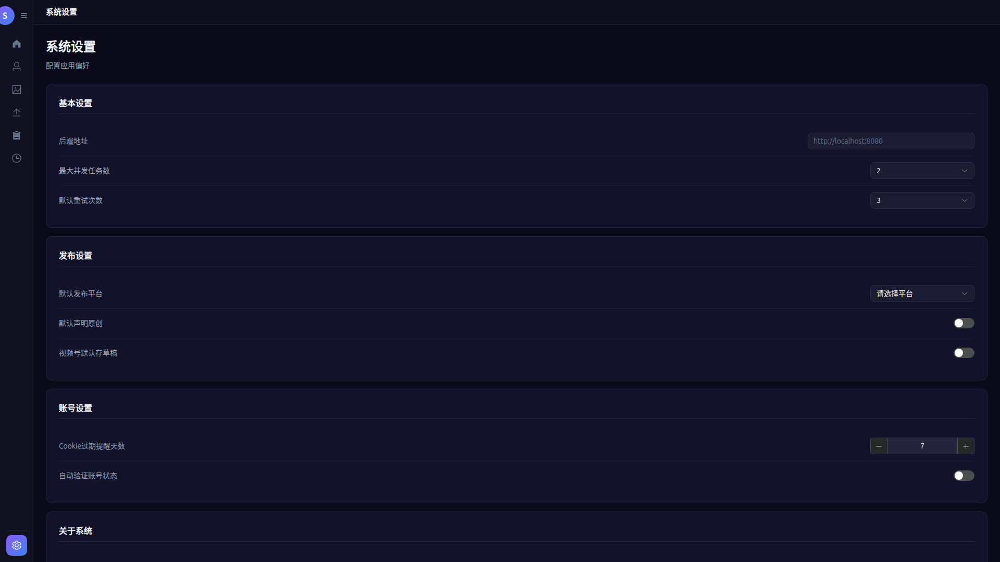

# AI 社交媒体自动上传工具 - 平台使用指南

> 本项目是基于 [dreammis/social-auto-upload](https://github.com/dreammis/social-auto-upload) 开源项目开发的 Web-UI 界面，底层功能基于原项目作针对性优化和修改。
> 如果您需要了解底层自动化能力的实现细节，请参考原项目。

**项目地址**：https://github.com/DevilJie/socialUpload
**开源协议**：MIT License

---

## 目录

1. [项目简介](#项目简介)
2. [功能特性](#功能特性)
3. [界面预览](#界面预览)
4. [快速开始](#快速开始)
5. [仪表盘（首页）](#仪表盘首页)
6. [账号管理](#账号管理)
7. [素材管理](#素材管理)
8. [发布中心](#发布中心)
9. [任务中心](#任务中心)
10. [发布历史](#发布历史)
11. [系统设置](#系统设置)
12. [常见问题](#常见问题)

---

## 项目简介

AI 社交媒体自动上传工具是一个多平台内容发布管理平台，支持同时向小红书、抖音、B站、快手、视频号等多个主流社交媒体平台自动化发布内容。

本项目的 Web-UI 界面基于 Vue3 + Vite + Element Plus 构建，提供现代化、易用的操作体验。底层自动化能力基于 [dreammis/social-auto-upload](https://github.com/dreammis/social-auto-upload) 开源项目，该项目专注于社交媒体自动化发布的底层实现。

### 技术栈

- **前端框架**：Vue 3 + Vite
- **UI 组件库**：Element Plus
- **状态管理**：Pinia
- **路由管理**：Vue Router
- **HTTP 客户端**：Axios
- **样式预处理**：Sass

---

## 功能特性

### 支持平台

| 平台 | 图标 | 说明 |
|------|------|------|
| 小红书 | 🌸 | 图片/视频内容分享平台 |
| 抖音 | 🎵 | 短视频分享平台 |
| B站 | 📺 | 年轻人文化社区（弹幕/长视频） |
| 快手 | 🎬 | 短视频分享平台 |
| 视频号 | 📹 | 微信生态短视频平台 |

### 核心功能

- **多平台支持**：一站式管理5大主流社交媒体平台
- **批量发布**：一次编辑，同时发布到多个平台
- **账号统一管理**：集中管理所有平台账号，支持Cookie自动维护
- **素材管理**：上传和管理视频、图片等素材
- **任务追踪**：实时查看发布状态和结果
- **批量操作**：批量检查账号状态、批量设置标题描述
- **定时发布**：支持选择发布时间
- **草稿保存**：发布前可保存草稿

---

## 界面预览

### 1. 首页仪表盘



首页展示数据概览和快捷操作入口，包括：
- **账号总数统计**：显示正常/异常账号数量
- **已接入平台概览**：各平台账号接入数量
- **素材总数统计**：视频、图片、其他素材数量
- **今日发布成功率**：实时统计发布成功率
- **快捷操作入口**：快速发布、上传素材、查看任务、账号管理
- **最近素材**：展示最近上传的素材

### 2. 快速发布入口



在首页点击「快速发布」卡片，可直接进入发布流程。

### 3. 账号管理



账号管理界面支持：
- 查看所有已接入平台账号
- 筛选特定平台账号（小红书、视频号、抖音、快手、B站）
- 批量检查账号状态
- 添加、编辑、删除账号
- 同步账号资料
- Cookie 管理

### 4. 添加账号弹窗



点击「添加账号」后弹出平台选择窗口，支持选择：
- 小红书
- 视频号
- 抖音
- 快手
- B站

### 5. 任务中心



任务中心展示所有发布任务，支持：
- 按状态筛选（全部、排队中、发布中、成功、失败）
- 搜索任务标题或账号
- 刷新任务状态
- Worker状态监控（活跃Worker数量、等待中任务数量）

### 6. 素材管理



素材管理支持：
- 查看所有已上传素材
- 搜索文件名
- 上传新素材
- 预览素材
- 删除素材

### 7. 发布中心



发布中心是最核心的功能页面，提供完整的内容发布能力：

#### 7.1 平台选择
- 支持同时选择多个平台发布
- 每个平台独立设置标题、描述、话题等
- 平台选择状态：未选择（灰色）、已选择（彩色）、已配置（绿色）

#### 7.2 素材选择
- **本地选择**：从本地文件系统中选择视频/图片
- **素材库**：从已上传的素材库中选择
- **上传**：支持直接上传新素材

#### 7.3 封面设置
- **横版封面**：上传横版视频封面
- **竖版封面**：上传竖版视频封面（如小红书）
- 可选择本地文件或从素材库选择

#### 7.4 内容设置
- **标题**：每个平台可独立设置标题
- **描述**：每个平台可独立设置描述
- **话题标签**：添加 # 话题
- **参加活动**：添加 $ 活动
- **添加好友/艾特**：@ 好友

#### 7.5 批量设置
- **批量设置标题和描述**：一次性为所有已选平台设置相同内容

#### 7.6 高级选项
- **合集选择**：选择发布的合集（部分平台支持）
- **群聊选择**：选择要发布的群聊
- **位置选择**：添加地理位置
- **内容类型声明**：原创/非原创声明
- **定时发布**：选择发布时间

#### 7.7 操作按钮
- **一键发布**：开始发布到所有已选平台
- **保存草稿**：保存当前发布配置

### 8. 发布历史



发布历史记录所有发布任务详情：
- **平台筛选**：按平台类型筛选
- **状态筛选**：按发布状态筛选
- **时间范围筛选**：按时间范围筛选
- **分页显示**：每页20条记录
- **任务详情**：平台、账号ID、标题、状态、时间、耗时
- **展开查看**：可展开查看更详细的发布信息

### 9. 系统设置



系统设置页面包含：

#### 9.1 后端服务配置
- **后端地址**：配置后端服务地址（默认 http://localhost:8080）
- **浏览器选择**：选择使用的浏览器
- **显示模式**：浏览器显示/隐藏模式

#### 9.2 并发设置
- **Worker数量**：配置并发发布Worker数量
- **失败重试**：开启/关闭失败自动重试
- **最大重试次数**：配置失败重试次数

#### 9.3 通知设置
- **通知推送**：开启/关闭系统通知
- **通知方式**：选择通知推送方式

---

## 快速开始

### 环境要求

| 依赖 | 版本要求 | 说明 |
|------|----------|------|
| Python | 3.10+ | 后端运行环境 |
| Node.js | 18+ | 前端构建 |
| npm/yarn | 最新版 | 包管理工具 |
| Chrome/Chromium | 最新版 | 浏览器自动化 |

### 安装步骤

#### 1. 克隆项目

```bash
git clone https://github.com/DevilJie/socialUpload.git
cd socialUpload
```

#### 2. 后端设置

```bash
cd backend

# 创建虚拟环境 (Python 3.10+)
python -m venv venv

# 激活虚拟环境
# Windows:
venv\Scripts\activate
# Linux/macOS:
source venv/bin/activate

# 安装依赖
pip install -r requirements.txt
```

#### 3. 前端设置

```bash
cd frontend

# 安装依赖
npm install

# 启动开发服务器
npm run dev
```

#### 4. 启动后端服务

在另一个终端中启动后端服务：

```bash
cd backend
# 确保虚拟环境已激活
python main.py
```

#### 5. 访问应用

打开浏览器访问：**http://localhost:5173/**

### Windows 系统打包

#### 使用 Tauri（桌面应用）

1. **安装 Rust**（Tauri 需要）
   ```bash
   # 从 https://rustup.rs/ 下载安装
   ```

2. **构建应用**
   ```bash
   # 从项目根目录
   cd src-tauri
   cargo tauri build
   ```

3. 构建完成的可执行文件在 `src-tauri/target/release/` 目录

#### 仅构建 Web 版本

```bash
cd frontend
npm run build
```

构建产物在 `frontend/dist/`，可部署到任意 Web 服务器。

---

## 仪表盘（首页）

仪表盘是用户登录后的默认页面，提供系统全局概览。

### 数据统计

- **账号统计**：显示所有平台的账号总数、正常账号数、异常账号数
- **平台统计**：显示各已接入平台的数量
- **素材统计**：显示视频、图片、其他素材的数量
- **发布统计**：显示今日发布成功率

### 快捷操作

- **快速发布**：一键进入发布流程
- **上传素材**：进入素材上传页面
- **查看任务**：进入任务中心
- **账号管理**：进入账号管理页面

### 最近素材

展示最近上传的素材，包括：
- 文件名
- 文件大小
- 文件类型
- 上传时间
- 预览入口

---

## 账号管理

### 账号列表

账号管理页面以表格形式展示所有已添加的账号，显示信息包括：
- 账号名称
- 所属平台
- 账号ID
- 状态（正常/异常）
- 操作按钮

### 平台筛选

支持按平台类型快速筛选：
- 全部
- 小红书
- 视频号
- 抖音
- 快手
- B站

### 账号操作

#### 添加账号

1. 点击「添加账号」按钮
2. 在弹窗中选择目标平台
3. 点击「确认」启动浏览器自动化登录流程
4. 系统自动完成登录授权并保存账号信息

#### 编辑账号

点击账号行的「编辑」按钮，可修改账号备注信息。

#### 同步资料

点击「同步资料」可更新该账号的基本信息（头像、昵称等）。

#### 创作中心

点击「创作中心」可快速跳转到对应平台的创作者后台页面。

#### Cookie 管理

每个账号有两组Cookie按钮：
- **Cookie（第一组）**：主要登录状态
- **Cookie（第二组）**：备用登录状态

点击可查看或更新该账号的Cookie信息。

#### 删除账号

点击「删除」按钮可移除该账号。

### 批量操作

- **批量检查**：一键检查所有账号的登录状态
- **刷新**：刷新账号列表

---

## 素材管理

### 素材列表

素材管理页面以卡片形式展示所有已上传的素材，显示信息包括：
- 素材缩略图
- 文件名
- 文件大小
- 文件类型（视频/图片/其他）
- 上传时间
- 操作按钮

### 搜索功能

支持按文件名搜索素材。

### 素材操作

#### 上传素材

1. 点击「上传素材」按钮
2. 在文件选择框中选择本地视频或图片文件
3. 系统自动识别素材类型并开始上传
4. 上传完成后自动显示在素材列表中

#### 预览素材

点击「预览」按钮可查看素材详情。

#### 删除素材

点击「删除」按钮可移除该素材。

---

## 发布中心

发布中心是核心功能页面，提供完整的多平台内容发布能力。

### 发布流程

#### 第一步：选择目标平台

在左侧平台列表中勾选要发布的平台。已选平台显示彩色图标，未选平台显示灰色图标。

#### 第二步：设置内容

1. **选择素材**：
   - 点击「本地选择」从本地文件选择
   - 点击「素材库」从已上传素材中选择
   - 点击「上传」直接上传新素材

2. **设置封面**：
   - 横版封面：适用于抖音、B站、快手等
   - 竖版封面：适用于小红书等

3. **填写标题和描述**：
   - 可为每个平台单独设置
   - 或使用「批量设置」一次性设置所有平台

4. **添加话题和活动**：
   - # 添加话题标签
   - $ 参加平台活动
   - @ 添加好友或@提及

#### 第三步：高级设置（可选）

1. **合集选择**：将内容添加到指定合集
2. **群聊选择**：选择要同步发布的群聊
3. **位置选择**：添加地理位置信息
4. **内容类型声明**：选择「原创」或「非原创」
5. **定时发布**：设置具体的发布时间

#### 第四步：发布

1. 确认所有设置无误后，点击「一键发布」
2. 系统开始按顺序向各平台发布内容
3. 可在任务中心查看实时进度

### 草稿功能

点击「保存草稿」可保存当前发布配置，方便后续编辑和发布。

---

## 任务中心

### 任务状态

任务中心展示所有发布任务，状态包括：
- **全部**：所有任务
- **排队中**：等待执行的发布任务
- **发布中**：正在执行的任务
- **成功**：已成功完成的任务
- **失败**：执行失败的任务

### Worker 监控

页面顶部显示当前Worker状态：
- **活跃 Worker**：正在执行任务的Worker数量
- **等待中**：排队等待的任务数量

### 搜索功能

支持按任务标题或关联账号搜索任务。

### 任务刷新

点击「刷新」按钮可更新任务列表状态。

---

## 发布历史

### 历史记录

发布历史页面以表格形式展示所有历史发布任务。

### 筛选功能

支持多维度筛选：
- **平台筛选**：按平台类型筛选
- **状态筛选**：按发布状态筛选
- **时间范围**：按发布时间范围筛选

### 任务详情

每条历史记录包含：
- **平台**：发布到的平台
- **账号ID**：使用的账号标识
- **标题**：发布内容的标题
- **状态**：发布结果（成功/失败）
- **时间**：发布时间
- **耗时**：发布耗时

### 分页

支持分页浏览，每页显示20条记录。

---

## 系统设置

### 后端服务配置

- **后端地址**：后端服务地址，默认为 `http://localhost:8080`
- **浏览器选择**：选择用于自动化操作的浏览器
- **显示模式**：选择浏览器是否显示运行

### 并发配置

- **Worker数量**：设置并发发布的Worker数量（默认为7）
- **失败重试**：开启后，发布失败的任务会自动重试
- **最大重试次数**：设置失败重试的最大次数

### 通知配置

- **通知推送**：开启/关闭系统通知
- **通知方式**：选择通知的推送方式

### 设置保存

修改设置后点击「保存设置」按钮保存配置。

---

## 常见问题

### Q: 账号登录失败怎么办？

A: 确保 Chrome/Chromium 浏览器已正确安装，必要时手动更新浏览器到最新版本。如果登录仍然失败，可能是平台的安全验证导致，请尝试：
1. 手动在浏览器中登录平台
2. 导出Cookie并手动导入

### Q: 发布任务失败如何处理？

A: 检查任务详情中的错误信息，常见原因包括：
- 账号登录状态过期（需重新授权）
- 网络连接问题
- 平台限制（如同一天发布次数限制）
- 内容违规被平台拦截
- 素材格式不支持

### Q: 如何更新素材？

A: 在素材管理页面删除旧素材后，重新上传新素材即可。

### Q: Worker数量设置多少合适？

A: Worker数量应根据你的账号数量和网络状况设置。建议：
- 账号较少（<5个）：Worker数量设为3-5
- 账号中等（5-15个）：Worker数量设为5-10
- 账号较多（>15个）：Worker数量设为10-15

注意：Worker数量过可能会导致账号被平台风控。

### Q: 如何实现定时发布？

A: 在发布中心的「选择时间」功能中设置具体的发布时间，系统会在指定时间自动执行发布任务。

---

## 附录：项目信息

### 原项目作者

[@dreammis](https://github.com/dreammis) - [dreammis/social-auto-upload](https://github.com/dreammis/social-auto-upload)


### 本项目维护者

[@程序员老蔡](https://github.com/DevilJie)


---

**如果这个项目对您有帮助，请给一个 ⭐ Star 以表示支持！**

[](https://star-history.com/#DevilJie/socialUpload&Timeline)